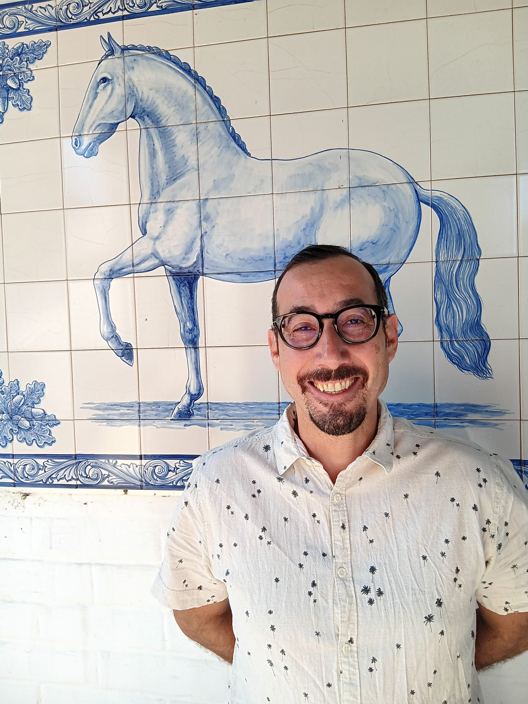

Aside
================================================================================

{width=80%}

Contact Info {#contact}
--------------------------------------------------------------------------------

- <i class="fa fa-envelope"></i> bastazini.vinicius@gmail.com
- <i class="fab fa-skype"></i> vinicius.bastazini 
- <i class="fa fa-github"></i> [github.com/bastazini](https://github.com/bastazini)
- <i class="fab fa-researchgate"></i> [Research Gate](https://www.researchgate.net/profile/Vinicius-Bastazini-2)
- <i class="fa fa-google"></i> [Google Scholar](https://scholar.google.com/citations?user=4X6LiBQAAAAJ&hl=pt-BR)
-  [0000-0001-5270-0621](https://orcid.org/0000-0001-5270-0621)

Expertise {#skills}
--------------------------------------------------------------------------------

- Bigeography
- Community Ecology 
- Evolutionary Ecology 
- Complex Networks 
- Conservation Biology

Main
================================================================================

Vinicius Augusto Galvão Bastazini {#title}
--------------------------------------------------------------------------------

### Summary

I have a broad (and when I say broad, I mean broad!) interest in Ecology, Evolutionary Biology and Conservation Biology, but my main interest lies in understanding the interplay between ecological and evolutionary dynamics and its consequences to patterns of biological diversity and species interactions. I address these kinds of questions by combining aspects of phylogenetics, network and functional ecology, using species traits as a biological building block to understand eco-evolutionary dynamics and their consequences to ecological communities and ecosystems services.

Education {data-icon=graduation-cap data-concise=true}
--------------------------------------------------------------------------------

###  Doctor of Science

Federal University of Rio Grande do Sul*

Porto Alegre, Brazil

2011 -  2015
 
Dissertation: Integrating Evolutionary and Ecological Processes in the Study of Interaction Networks.

*Title recognized by the University of Lisbon 2019

### Master's degree in Ecology

Federal University of Rio Grande do Sul

Porto Alegre, Brazil

2009 -  2011

Thesis: Effects of Habitat and Spatial Structure on Mammalian Diversity in Northern Pantanal: A Fine Grain Approach

###  Bachelor of Science in Ecology

Catholic University of Pelotas 

Pelotas, Brazil

2004 -  2007

Undergraduate Thesis: Spatial Analysis of the Trophic Ecology of the Neotropical Otter (Lontra Longicaudis) (Olfers, 1818) (Mustelidae: Lutrinae)

Professional Experience {data-icon=suitcase}
--------------------------------------------------------------------------------

### Researcher / Professor

University of  Évora

Évora, Portugal

2021 - present

### Research Fellow

Federal University of Rio Grande do Sul - Road and Railroad Ecology Center 

Porto Alegre, Brazil

2020

### Post-doctoral  Researcher

French National Center for Scientific Research

Moulis, France

2017 - 2019

### Research Fellow

Federal University of Rio Grande do Sul - Laboratory of Quantitative Ecology

Porto Alegre, Brazil

2016

### Professor Biostatistcs

Catholic University of Pelotas  - Specialization in Conservation Biology

Pelotas, Brazil

2013

### Research Fellow

Catholic University of Pelotas

Pelotas, Brazil

2008 - 2009

### Research Fellow

Federal University of Rio Grande do Sul

Porto Alegre, Brazil

2008 - 2009

### Co-founder and Member of the Executive Committee

Pró-Pampa Institute

Pelotas, Brazil  

2006 - 2010

Publications{data-icon=file}
--------------------------------------------------------------------------------

### PEER-REVIEWED ARTICLES 

N/A

N/A

N/A

### Elevational shifts in tree community composition in the Atlantic Forest under climate change 

*Journal of Vegetation Science* 

N/A

Under review

Bergamin, R.S. **Bastazini, V.A.G.**, Esquivel-Muelbert, A., Bordin, K.M.,Klipel, J., Debastiani, V.J., Vibrans, A., Loyola, R., Müller, S.C. 

### Network and parasitological analyses reveal latitudinal gradient in bats-ectoparasitic flies interactions across the Neotropic 

*Ecology and Evolution* 

N/A

In press

Biz, L. **Bastazini, V.A.G.**, Carvalho, F., Pereira, M.J.R.

### The role of evolutionary modes for trait-based cascades in mutualistic networks

*Ecological Modelling* 470: 109983

N/A

2022

**Bastazini, V.A.G.**, Debastiani, V., Cappelatti, L., Guimarães, P., & Pillar, V.P.

### Ecological network complexity scales with area 

*Nature Ecology and Evolution*  6: 307–314

N/A

2022

Galiana, N., Lurgi M., **Bastazini, V.A.G.**, Bosch, J., Cagnolo, L., Cazelles, K., Claramunt-López, B., Emer, C., Fortin, M., Grass, I., Hernández-Castellano, C., Jauker, F., Leroux, S.J., McCann, K., McLeod, A.M., Montoya, D., Mulder, C., Osorio-Canadas, S., Reverté, S., Rodrigo, A., Steffan-Dewenter, I., Traveset, A., Valverde, S., Vázquez, D.P, Wood, S.A., Gravel, D., Roslin, T., Thuiller, W. & Montoya, J.M. 

### Native and alien grassland diversity respond differently to environmental and anthropogenic drivers across spatial scales

*Journal of Vegetation Science* 33(3): e13133

N/A

2022

Bergamin, R S., Ascensão, F., Capinha, C.,  **Bastazini, V.A.G.**, Andrade, B. O., Boldrini, I. I., Lezama, F., Altesor, A., Perelman, S., & Overbeck, G.E.

### Mainstreaming ecological connectivity in road environmental impact assessments: a long way to go

*Impact Assessment and Project Appraisal* 40 (6): 475-480

N/A

2022

Gonçalves, L.O., Kindel, A., **Bastazini, V.A.G.**,  & Teixeira, F.Z.

### Phylogenetic uncertainty and the inference of patterns in community ecology and comparative studies

*Oecologia* 196: 633–647

N/A

2021 

Debastiani, V., **Bastazini, V.A.G.** & Pillar, V.P. 

### Using phylogenetic information to impute missing functional trait values in ecological databases

*Ecological Informatics* 63: 101315

N/A

2021 

Debastiani, V., **Bastazini, V.A.G.** & Pillar, V.P. 

### The impact of climate warming on species diversity across scales: Lessons from experimental meta‐ecosystems 

*Global Ecology and Biogeography* 30 (7): 1545-1554

N/A

2021

**Bastazini, V.A.G.** Galiana, N., Hillebrandt, H., Estiartes, M., Ogayas, R., Peñuelas, J., Sommer, U. &  Montoya, J. M.

### Species richness and patterns of overdispersion, clustering and randomness shape phylogenetic and functional diversity-area relationships in habitat islands. 

*Journal of Biogeography* 47 (8): 1638-1648

N/A

2020

Dias, R. A., **Bastazini, V.A.G.**, Kock, B., Bonow, F. C., Sanyvan, M. S. & Gianuca, A. T. 2020.

### Including rewiring in the estimation of the robustness of mutualistic networks

Methods in Ecology and Evolution 11 (1): 106-116

N/A

2020

Vizentin-Bugoni, J., Debastiani, V.J., **Bastazini, V.A.G.**, Maruyama, P.K. & Sperry J.H

### NEOTROPICAL CARNIVORES: a dataset of occurrence of carnivores in the Neotropics.

*Ecology* 101 (11): e03128

N/A

2020

Nagy-Reis, M.B.,[ …], **Bastazini, V. A. G.**, et al. 

### NEOTROPICAL ALIEN MAMMALS: a dataset of occurrence and abundance of alien mammals in the Neotropics

*Ecology* 101 (11): e03115.

N/A

2020

Rosas, C., […], **Bastazini, V. A. G.**, et al. 

### Loss of generalist plant species and functional diversity decreases the robustness of a seed dispersal network

*Environmental Conservation* 46 (1): 52-58.

N/A

2019

**Bastazini, V. A. G.**, Debastiani, V., Azambuja, B., Guimarães, P., & Pillar, V.

### NEOTROPICAL XENARTHRANS: a data set of occurrence of xenarthran species in the Neotropics

*Ecology* 100(7): e02663
       
N/A

2019

Santos, P.,[ …], **Bastazini, V. A. G.**, et al.

### Assessing sampling sufficiency of network metrics using bootstrap

*Ecological Complexity* 36: 268-275

N/A

2018

Casas, G., **Bastazini, V. A. G.**, Debastiani, V. J., & Pillar, V. D. P. 2018.

### Environmental predictors of demography in the tuco-tuco of the dunes (Ctenomys flamarioni)

*Mastozoología Neotropical* 25 (2): 293-304

N/A

2018

Garcias, F. M., Stolz J., Fernández G. P, Kubiak B. B, **Bastazini, V. A. G.** & Freitas T. R. O.

### Reptile road-kills in Southern Brazil: Composition, hot moments and hotspots

*Science of the Total Environment* 615: 1438-1445

N/A

2018

Gonçalves, L. O., Alvares, D. J., Teixeira, F. Z., Schuck, G., Coelho, I. P., Esperandio, I. B., Anza, J., Beduschi, J., **Bastazini, V. A. G.** & Kindel, A.

### Untangling the tangled bank: A novel method for partitioning the effects of phylogenies and traits on ecological networks

*Evolutionary Biology* 44: 312–324

N/A

2017

**Bastazini, V. A. G.**, Abreu, P. M., Azambujo, B., Casas, G., Debastiani, V., Guimarães Jr, P. R. & Pillar, V. P.

### Livestock disturbance in southern Brazilian grasslands influences avian species diversity via turnover

*Biodiversity and Conservation* 26: 2473–2490

N/A

2017

Dias, R. D., Gianuca, A., Vizentin-Bugoni, J., Bencke, G. A. & **Bastazini, V. A. G.** 

### Linking beta diversity patterns to protected areas: Lessons from the Brazilian Atlantic Forest

*Biodiversity & Conservation* 26: 1557–1568.

N/A

2017

Bergamin, R. S., **Bastazini, V.A.G.**, Vélez-Martin, E., Debastiani, V., Zanini, K. J., Loyola, R. & Müller, S.C.

### Implications of climatic seasonality on activity patterns and resource use by sympatric peccaries in northern Pantanal

*International Journal of Biometeorology* 60: 421-433

N/A

2016

Hofmann, G. S., Coelho, I. P., **Bastazini, V. A. G.**, Cordeiro, J. L. P. & Oliveira, L.F. B.

### Choosing and using traits in functional diversity research

*Environmental Conservation* 42: 104-107

N/A

2015

Lefcheck, J., **Bastazini, V. A. G.** & Griffin, J. N.

### Taxonomic and functional diversity of woody plant communities on opposing slopes of inselbergs in southern Brazil

*Plant Ecology and Diversity* 8: 187-197

N/A

2015

Carlucci, M. B., **Bastazini, V. A. G.**, Hofmann, G. S., Macedo, J.H., Iob, G., Duarte, L. D. S., Hartz, S.M. & Müller S.C.

### Climate effects on amphibian distribution depend on phylogenetic scale and biogeography

*Global Ecology and Biogeography* 23: 213-222

N/A

2014

Duarte, L. S., Both, C., Carlucci, M., Debastiani, V., Cappelatti, L., Seger, G., Salengue, E., **Bastazini, V. A. G.**, Gonçalves, L. O., Brum, F. T. & Bernardo-Silva, J.

### Bird-habitat associations in coastal rangelands of southern Brazil

*Iheringia - Série Zoologia* 104: 200-208

N/A

2014

Dias, R. A., Gianuca, A. T. & **Bastazini, V. A. G.**

### Independent and shared effects of environmental features and space driving avian community beta-diversity across a coastal gradient in southern Brazil

*Austral Ecology* 38: 864–873

N/A

2013

Gianuca, A. T., **Bastazini, V. A. G.**, Dias, R. A. & Hernández, M. 2013.

### Shifts in composition of avian communities related to temperate-grassland afforestation in southeastern South America

*Iheringia - Série Zoologia* 103: 12-19

N/A

2013

Dias, R. A., **Bastazini, V. A. G.**, Gonçalves, M. S. S., Bonow, F. C. & Müller, S.

### Feeding ecology of Lontra longicaudis in the lower Arroio Grande, southernmost Brazil

*Anais da Academia Brasileira de Ciências* 85: 285-294

N/A

2013

Sousa, K. S., **Bastazini, V. A. G.** & Colares, E. P.

### Abundance of Conepatus chinga (Carnivora: Mephitidae) and other medium-sized mammals in grasslands of southern Brazil

*Iheringia - Série Zoologia* 102: 303-310

N/A

2012

Kasper, C. B., **Bastazini, V. A. G.**, Soares, J. B. G. & Freitas, T. R. O.

### First breeding record of the bay-capped wren-spinetail (Spartonoica maluroides) in Brazil, with nest and nestling descriptions and nesting behavior notes

*Iheringia - Série Zoologia* 99: 449-455. 2009

N/A

2009

Dias, R. A., Gonçalves, M. S. S. & **Bastazini, V. A. G.** 

### Trophic ecology and the use of shelters and latrines by the Neotropical otter (Lontra longicaudis) in the Taquari Valley, Rio Grande do Sul, Brazil

*Iheringia - Série Zoologia* 98: 1-6

N/A

2008

Kasper, C. B., **Bastazini, V. A. G.**, Salvi, J. & Grillo, H. C. Z. 

### BOOKS AND BOOK CHAPTERS

N/A

N/A

N/A

### Road effects on biotic interactions
In: (eds) D'Amico, M., Barrientos, R., Ascensão, F. *Road Ecology: Synthesis and Perspectives*.  Elsevier Science Publishing Co.

Germany

In press

Mestre, F., Quiles, P., **Bastazini, V.A.G.**, Ascensão, F.

### Biodiversidade e conservação de ecossistemas aquáticos do sul do Brasil (Biodiversity and conservation of aquatic ecosystems in southern Brazil). 
USEB

Brazil

In press

Gonçalves, M., **Bastazini, V.A.G.**, Andretti, C.,   Lanés, L. E., Volcan, M.

### Identificando o potencial de conservação de áreas úmidas usando ferramentas da teoria de redes complexas (Unravelling the conservation potential of wetlands using complex network tools)
In: (eds) Gonçalves, M., **Bastazini, V.A.G.**, Andretti, C.,   Lanés, L. E., Volcan, M. *Biodiversidade e conservação de ecossistemas aquáticos do sul do Brasil*. USEB

Brazil

In press

**Bastazini, V. A. G.**,  Gianuca, A.T., Vizentin-Bugoni J.,  Gonçalves, M.S.S., & Dias R.A.

### Ecossistemas Aquáticos Continentais do sul do Brasil: Contexto histórico e desafios para a conservação (Aquatic Ecosystems of Southern Brazil: Historical Context and Challenges for Conservation)
In: (eds) Gonçalves, M., **Bastazini, V.A.G.**, Andretti, C.,   Lanés, L. E., Volcan, M. *Biodiversidade e conservação de ecossistemas aquáticos do sul do Brasil*. USEB

Brazil

In press

Gonçalves, M., **Bastazini, V.A.G.**, Andretti, C.,  Lanés, L. E., Volcan, M.

### A fragmentação afeta a dinâmica das populações do arredio-do-gravatá (Limnoctites rectirostris) em manchas de áreas úmidas continentais (Habitat fragmentation compromises the population dynamic of the Straight-billed Reedhaunter in continental wetlands)
In: (eds) Gonçalves, M., **Bastazini, V.A.G.**, Andretti, C.,   Lanés, L. E., Volcan, M. *Biodiversidade e conservação de ecossistemas aquáticos do sul do Brasil*. USEB

Brazil

In press.

Gonçalves M. S., Pons, P., Bonow, F., **Bastazini, V. A. G.**, Gil-Delgado, J. & Iborra, G.L.

### Fauna da Reserva Particular do Patrimônio Natural SESC Pantanal: uma perspectiva através de armadilhas fotográficas (Fauna of the SESC Pantanal Natural Heritage Private Reserve: a perspective through camera traps).
SESC Publishing Co. 

Brazil

2013

Hoffman, G. S., **Bastazini, V. A. G.**, Coelho, I. P., Oliveira, L. F. B.

Teaching Experience {data-icon=chalkboard-teacher}
--------------------------------------------------------------------------------

### Biogeography

University of Evora

Evora, Portugal

2022 - present

### Biostatistic using R

Dep. Botany - Federal University of Rio Grande do Sul

Porto Alegre, Brazil

2017

### Introduction to Quantitative Ecology

Federal University of Pelotas

Pelotas, Brazil

2014

### Theoretical Ecology

Federal University of Rio Grande do Sul

Porto Alegre, Brazil

2011 - 2013

### Introduction to Quantitative Ecology

Zoo-botanic Foundation of Rio Grande do Sul

Porto Alegre, Brazil

2013

### Introduction to R

Pontifical Catholic University of Rio Grande do Sul

Porto Alegre, Brazil

2013 

### Introduction to Quantitative Ecology

Federal University of Pelotas

Pelotas, Brazil

2012 

### Quantitative Methods Applied to Ecology

Federal University of Rio Grande do Sul

Porto Alegre, Brazil 

2011

### Statics Applied to Ecology and Conservation Biology

Federal University of Pelotas

Pelotas, Brazil

2009

### Sampling and Analysis Techniques in Bird Ecology

Lagoa do Peixe National Park / ICMBio

Mostardas, Brazil

2008

### Sampling and Analysis Techniques in Animal Ecology

Catholic University of Pelotas

Pelotas, Brazil 

2008

### Biodiversity Management and Conservation

NGO Interação de Trabalhos Ambientais

Caçapava do Sul, Brazil

2007

Academic Advisory {data-icon=user-friends}
--------------------------------------------------------------------------------

### Talita Menger Ribeiro
Dissertation - PhD Degree in Ecology, University of Évora. (Advisor Doctoral Sandwich Program -CNPq). 

Évora, Portugal

2023

### Bibiana Terra Dasoler de Oliveira
Dissertation - PhD Degree in Ecology, University of Évora. (Co-advisor Doctoral Sandwich Program -CAPES). 

Évora, Portugal

2022 - 2023

### Bruna de Castro Knopp
Thesis - Master's Degree in Animal Biology, Federal University of Pelotas. (Co-advisor). Relationship Between Wetland Area and Taxonomic, Functional and Phylogenetic Diversity of Birds in Southern Brazil.

Pelotas, Brazil

2018

### Timóteo Matthias Rico
Monograph - Specialization in Conservation Biology, Catholic University of Pelotas, Brazil. Data Mining Applied to Conservation Biology: A case study on the extinction risk of mammals from Rio Grande do Sul

Pelotas,Brazil

2014

### Diogo Maia Gräbin
Monograph – Bachelor’s Degree in Biology, Federal University of Rio Grande do Sul, Brazil. Density and Spatial Distribution of Rhea americana in Different Physiognomies of the Pantanal of Nhecolândia

Porto Alegre, Brazil

2012

Invited Talks  {data-icon=chalkboard-teacher}
--------------------------------------------------------------------------------

### Cambios Climáticos: Re-enmarañando el enmarañado Darwiniano

Pedagogical and Technological University of Colombia

Colombia

2023

###  Climate change: Re-shuffling the Tangled Bank

Institute of Geography and Spatial Planning - University of Lisbon

Portugal

2022

###  Understanding the responses of mutualistic networks to climate change through the lens of evolutionary history

Norwegian Institute for Nature Research

Norway

2022

### Ecological networks

Dep. of Ecology – Federal University of Rio Grande do Sul

Porto Alegre, Brazil

2020

### Trait redundancy and the Structure and Stability of Mutualistic Networks: An Evolutionary approach

Emílio Goeldi Museum

Belém do Pará, Brazil

2020

### Climate Change: Re-shuffling the tangled bank

Biology Program. Federal Institute Farroupilha 

Santa-Maria, Brazil

2020
 
### Climate-driven phenological shifts and the future of mutualist networks

Graduate Program in Animal Biology – Federal University of Pelotas

Pelotas, Brazil

2020

### Climate-driven phenological shifts and the eco-evolutionary dynamics of mutualistic networks

Dep. of Animal Biology – Federal University of Rio Grande do Sul

Porto Alegre, Brazil

2020

### Trait redundancy and the Structure and Stability of Mutualistic Networks

University of Valencia

Valencia, Spain

2018

### Untangling the Tangled Bank: Phylogenetic- and Trait-based approaches in Network ecology

University of Lisbon

Lisbon, Portugal

2018

### Untangling the Tangled Bank: Phylogenetic- and Trait-based approaches in Network ecology 

Higher Institute of Agronomy

Lisbon, Portugal

2018

### Merging phylogenetic- and trait-based approaches into Network Ecology

Swansea University

Swansea, Wales

2017

### Coextinction and robustness in mutualistic networks: eco-evolutionary dynamics and patterns

Dep. of Ecology – Federal University of Rio Grande do Sul

Porto Alegre, Brazil

2016

### Coextinction and robustness in mutualistic networks: eco-evolutionary dynamics and patterns

Dep. of Ecology – University of Vale dos Sinos

São Leopoldo, Brazil

2016

### Untangling the tangled bank: a novel method for partitioning the effects of phylogenies and traits on ecological networks

University of São Paulo

São Paulo, Brazil

### Coextinction and robustness in mutualistic networks

Dep. of Animal Biology – Federal University of Rio Grande do Sul

Porto Alegre, Brazil

2015

### Untangling the tangled bank: evolutionary and ecological components in interaction networks

I International Seminar of Ecological Research and Education

Pelotas, Brazil

2012

### Species Detectability in Mammalogy Studies: Implications and Analytical Solutions 

Econsciência Institute

Viamão, Brazil

2011

### Considerations on the Use of Camera Traps in Conservation Biology

Federal University of Rio Grande do Sul/ Curicaca Institute

Porto Alegre, Brazil

2011

### Independent and shared effects of area and habitat driving avian community structure in the São Gonçalo Channel

Catholic University of Pelotas

Pelotas, Brazil

2010

Grants, Awards and Funding {data-icon=award}
--------------------------------------------------------------------------------
### Coordination of Superior Level Staff Improvement
Doctoral fellowship (R$105,600)

Porto Alegre, Brazil

2011 - 2015

### International Association for Vegetation Science
Travel Grant (€1,700)

Perth, Australia

2014

### Coordination of Superior Level Staff Improvement
MSc fellowship (R$36,000)

Porto Alegre, Brazil

2009 - 2011

### Helmut Sick Award
XVII Brazilian Congress of Ornithology

N/A

2009

Member of Editorial Board {data-icon=search}
--------------------------------------------------------------------------------
### Functional Ecology

Associate Editor

N/A

2023 - present

Reviewer  {data-icon=search}
--------------------------------------------------------------------------------
### Journals

N/A

N/A 

N/A

::: concise
- Agriculture, Ecosystems and Environment
- Annals of the Brazilian Academy of Sciences
- Arthropod-Plant Interactions
- Biological Conservation
- Community Ecology 
- Ecography
- Ecology Letters
- Evolutionary Ecology
- Forest Ecology and Management
- Frontiers in Ecology and Evolution
- Iheringia - Série Botânica
- Iheringia – Série Zoologia
- Journal of Animal Ecology
- Journal of Biogeography
- Methods in Ecology and Evolution
- Oikos
- Perspectives in Ecology and Conservation
- Perspectives in Plant Ecology Evolution and Systematics
- Plos Biology
- Proceedings of the National Academy of Sciences
- Scientific Reports
- The Science of Nature
::: 

### Books

N/A

N/A

### Ecologia I: Explorando as inter-relações da vida sob a ótica evolutiva. 
In: Ensino de Biologia: uma perspectiva evolutiva - Volume I: Biodiversidade & Evolução. 

N/A

2020

### Ecologia II: Impactos antrópicos e efeitos eco-evolutivos sobre a biodiversidade.
In: Ensino de Biologia: uma perspectiva evolutiva - Volume II: Biodiversidade & Evolução.

N/A

2020

### As interações planta - polinizador e a estrutura de comunidades. 
In: Ecologia de Interações Planta-Polinizador.

N/A

2013

Outreach {data-icon=laptop}
--------------------------------------------------------------------------------

### Blog Geekcologist
Writer

Portugal

2021 - present

### Blog Biodiverse Perspectives
Co-founder, Writer and International Communications and Outreach Chairman

USA

2013 - 2019

